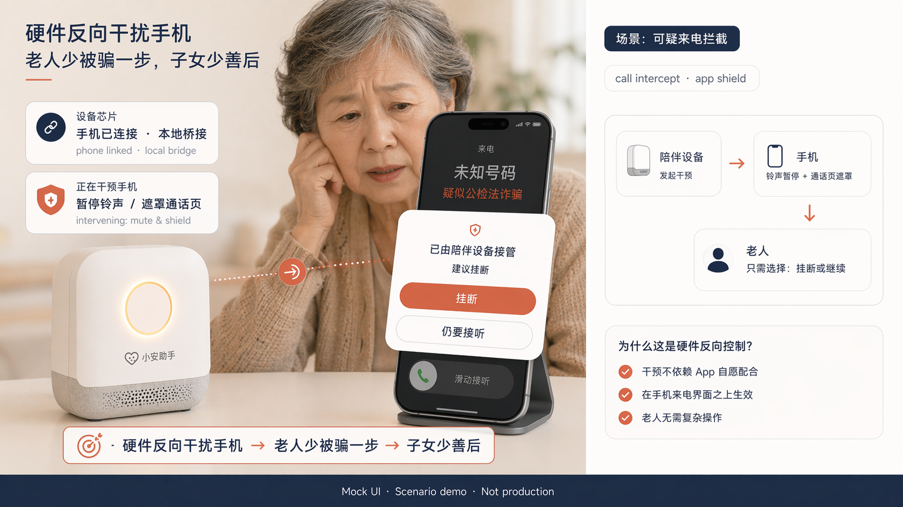
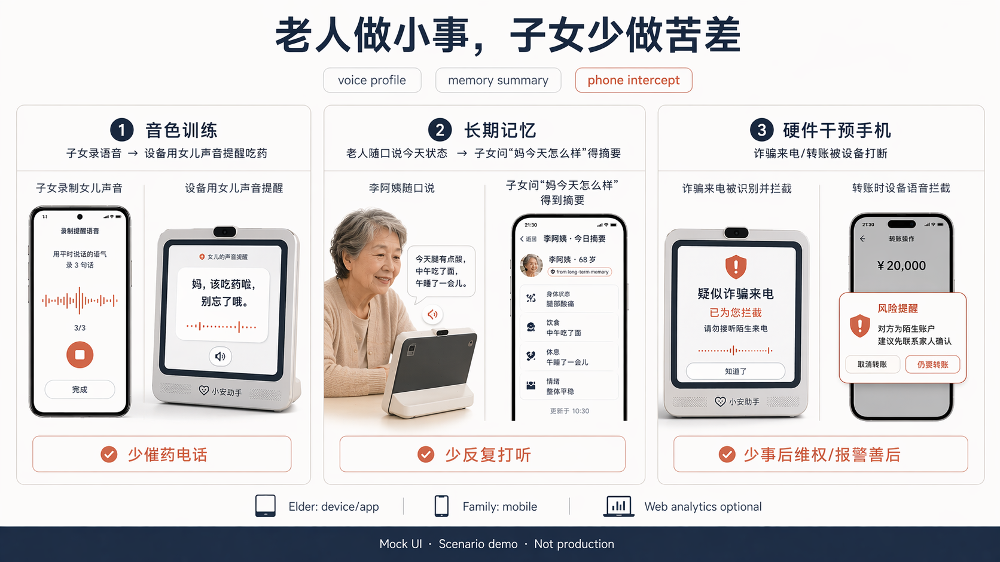

# AI Companion Runtime

面向老龄照护场景的实时 AI 陪伴 + 风险分级运行时。基于 WebSocket 的流式对话，支持风险识别（健康紧急/诈骗识别/情绪低落）、工具调用、长期记忆、模型热插拔与全链路 Trace 观测。

## Current verified status

Last updated: 2026-07-09

This repository is the canonical home for the merged AI companion runtime and eldercare device integration work. The earlier device-focused repo `https://github.com/yf0522/elder-companion-runtime` is being consolidated here; application follow-up material should point reviewers to this repo and mention that consolidation explicitly.

| Area | Current status |
|---|---|
| WebSocket companion runtime | Implemented: `/ws/chat` protocol, trace IDs, first reply, deltas, tool status/results, and final messages. |
| Analyzer pipeline | Implemented: intent, emotion, risk, personality, memory, prompt builder, and timeout-oriented harness flow. |
| Risk detection | 已对接老龄场景类别：`health_emergency`、`scam_alert`、`emotional_low`；关键字/正则 + 否定词 + 安全上下文已由测试覆盖。 |
| Model routing | Implemented: configurable model registry with primary/fallback/fast roles and OpenAI-compatible adapters. |
| Tool dispatch | Implemented: weather, search, calculator, and reminder tool paths. |
| Reminder output for devices | Implemented: reminder tool emits structured timer/alarm/countdown fields; full ESP32 local trigger evidence still needs a captured hardware test pass. |
| Device realtime WebSocket | 已落地，并在单测中验证关键行为（JWT、PCM 收发、ASR 回退、模型/TTS 流转）。依赖如 DashScope 的集成验证需补充完整运行环境。 |
| Hardware device validation | 先前仓库中有 ESP32-S3 构建与二次唤醒验证记录；当前仓未包含可复现硬件日志文件，需补充后再标为完全通过。 |
| Family notification | `/api/notifications` 已接入持久化通知事件（`notification_log`）；手机推送/webhook provider 与多渠道回执仍在 roadmap。 |
| Investor demo material | 已补充在 [docs/investor-demo.md](docs/investor-demo.md)；设备验证清单见 [docs/device-test.md](docs/device-test.md)；公开演示图片与 Mock 免责声明见 [docs/evidence/README.md](docs/evidence/README.md)。 |
| License | MIT, with a root `LICENSE` file so GitHub can detect it. |

## Demo evidence

Mock UI · scenario demo. These visuals illustrate intended eldercare flows and should not be presented as production screenshots.

### 1. Voice profile and trust reminder


### 2. Daily memory and family summary


### 3. Hardware-assisted phone intercept



### 4. Labor saved overview



## 架构总览

```
用户端 (Next.js 14)
  │ WebSocket
  ▼
WebSocket Gateway → Session Manager → TraceID 生成
  │
  ▼
并行分析器 (asyncio.gather, 各自超时独立)
  ├─ Intent Engine    意图识别 (100ms)
  ├─ Emotion Engine   情绪识别 (100ms)
  ├─ Risk Engine      风险分级 (100ms)
  └─ Memory Engine    记忆召回 (300ms)
  │
  ▼
Agent Harness 编排
  ├─ Risk 拦截 (high/critical → 安全消息)
  ├─ Fast Reply 赛马 (300ms 超时)
  ├─ Prompt Builder (personality + memory + context)
  ├─ Model Router → Model Adapter → 流式 delta
  ├─ Tool Dispatcher (异步, 不阻塞主回复)
  └─ 重试 / 降级 / 超时控制
  │
  ▼
WebSocket 流式返回: trace → first_reply → delta → tool_result → final

后台异步 (Celery):
  ├─ Memory 压缩 & 归档
  ├─ Embedding 生成
  ├─ Reflection 用户画像更新
  └─ Trace 写入
```

## 技术栈

| 层 | 技术 |
|---|------|
| 前端 | Next.js 14 + TypeScript + TailwindCSS + Zustand |
| 后端 | Python 3.11 + FastAPI + WebSocket |
| 数据库 | PostgreSQL 16 + pgvector + Alembic |
| 缓存 | Redis 7 |
| 对象存储 | MinIO |
| 异步任务 | Celery + Redis |
| 观测 | OpenTelemetry + Jaeger + Prometheus + Grafana |
| 模型 | Adapter 模式, 支持 Qwen / DeepSeek / OpenAI / Gemini / 本地模型 |
| 部署 | Docker Compose |

## 核心特性

### WebSocket 实时通信
- 流式消息协议: `trace → risk_alert → first_reply → delta → tool_status → tool_result → final`
- 断线重连 (指数退避, 最多 10 次)
- 心跳检测 (ping/pong)
- 中断生成 (stop_generation)

### Agent Harness
- 5 步流水线编排 (trace → analyzer → risk → fast reply → stream)
- 可配置超时 / 重试 / 降级策略 (`harness.yaml`)
- Fast Reply 赛马: 300ms 内主模型没出首 token 就用快速模型兜底
- 工具调用不阻塞主回复

### 情绪引擎
- 规则 + 关键词匹配, 识别 7 种情绪 (joy / sadness / anger / fear / fatigue / anxiety / neutral)
- 强度评分 (0-1) + 情感极性 (valence)
- 强度修饰词识别 ("很累" vs "有点累")

### 风险分级
- 4 级响应: low → medium → high → critical
- 关键词 + 正则匹配, 无模型调用, < 2ms
- critical/high 立即拦截, 返回安全消息 + 心理热线

### 动态人格
- `personality.yaml` 定义基础人格 + 适配矩阵
- 根据情绪状态动态调节语气、长度、禁忌词
- 疲惫时更柔和短句, 焦虑时具体拆解, 任务模式简洁高效

### 模型热插拔
- `models.yaml` 配置 primary / fallback / fast 三个角色
- 修改文件自动热加载, 无需重启
- 统一 OpenAI 兼容接口, 一个 Adapter 覆盖 Qwen / DeepSeek / OpenAI / 本地模型

### Memory 五层
```
L0 Working Memory   Redis List    最近 20 条消息      < 1ms
L1 Session Summary   Redis String  会话摘要 (500字)     < 1ms
L2 User Profile      PG + Redis    用户画像            < 5ms
L3 Vector Memory     PG + pgvector 重要记忆 embedding   300ms 超时跳过
L4 Archive           MinIO         历史 JSONL 归档      不进入实时链路
```

### 工具系统
- Weather (wttr.in, 免费无 key)
- Search (DuckDuckGo HTML)
- Calculator (ast.parse 安全求值)
- Reminder (V1 确认+日志, 后续接 Celery 定时)

### 全链路 Trace
- 每次请求生成 `trace_id`, 记录所有步骤: 意图/情绪/风险/记忆/模型/工具
- `GET /api/traces/{trace_id}` 查询完整链路
- 前端 Trace Timeline 可视化 (瀑布图 + 延迟条)
- TTFT / Total Latency / Token 用量 / 成本统计

## 快速开始

### 1. 克隆项目

```bash
git clone https://github.com/yf0522/ai-companion-runtime.git
cd ai-companion-runtime
```

### 2. 配置环境变量

```bash
cp .env.example .env
# 编辑 .env, 填入你的模型 API Key:
# QWEN_API_KEY=sk-your-key  (阿里云百炼)
# DEEPSEEK_API_KEY=sk-your-key
```

### 3a. Docker Compose 启动 (推荐)

```bash
cd infra
docker compose up -d
```

服务端口:
- 前端: http://localhost:3000
- 后端 API: http://localhost:8000
- Swagger 文档: http://localhost:8000/docs
- MinIO Console: http://localhost:9001
- Jaeger UI: http://localhost:16686
- Prometheus: http://localhost:9090
- Grafana: http://localhost:3001

### 3b. 本地开发启动

**基础服务** (Redis 必须, PostgreSQL 可选):

```bash
# macOS
brew install redis postgresql@16 pgvector
brew services start redis
brew services start postgresql@16

# 创建数据库
psql postgres -c "CREATE USER companion WITH PASSWORD 'companion_secret';"
psql postgres -c "CREATE DATABASE companion OWNER companion;"
```

**后端:**

```bash
cd apps/api
python3 -m venv .venv
source .venv/bin/activate
pip install -e ".[dev]"

# 运行 migration
alembic upgrade head

# 启动
uvicorn app.main:app --host 0.0.0.0 --port 8000
```

**前端:**

```bash
cd apps/web
npm install
npm run dev
```

打开 http://localhost:3000 开始聊天。

## 项目结构

```
ai-companion-runtime/
├── apps/
│   ├── api/                    # FastAPI 后端
│   │   └── app/
│   │       ├── api/            # HTTP/WS 端点 (ws_chat, ws_device_realtime, traces, auth, memory, alerts)
│   │       ├── config/         # YAML 配置 (models, harness, personality, risk_rules)
│   │       ├── runtime/        # 核心运行时 (gateway, harness, stream, prompt_builder)
│   │       ├── engines/        # 分析引擎 (intent, emotion, risk, personality, memory)
│   │       ├── models/         # 模型层 (router, registry, adapters)
│   │       ├── tools/          # 工具 (weather, search, calculator, reminder)
│   │       ├── observability/  # 追踪与指标 (trace_service, metrics, cost_tracker)
│   │       ├── workers/        # Celery 异步任务
│   │       ├── storage/        # Redis + MinIO 客户端
│   │       └── db/             # SQLAlchemy + Alembic
│   └── web/                    # Next.js 前端
│       ├── app/                # 页面 (chat, traces, login, notifications)
│       ├── components/         # 组件 (ChatWindow, Sidebar, MessageBubble, TraceTimeline)
│       ├── stores/             # Zustand (chatStore, wsStore, authStore)
│       └── lib/                # WebSocket / API 客户端
├── firmware/                   # 设备端（来自 elder-companion-runtime 合并与对齐后的目录/历史）
├── infra/                      # Docker Compose + Prometheus + Grafana
└── CLAUDE.md                   # 项目开发规范
```

## 配置文件

| 文件 | 说明 |
|------|------|
| `models.yaml` | 模型配置 (primary/fallback/fast), 修改后自动热加载 |
| `harness.yaml` | Agent Harness 超时/重试/降级策略 |
| `personality.yaml` | AI 人格 + 情绪适配矩阵 |
| `risk_rules.yaml` | 风险关键词/正则/分级规则 |

## WebSocket 协议

连接: `ws://localhost:8000/ws/chat?token=JWT`

```
客户端 → 服务端:
  { "type": "user_message", "message": "我今天好累" }
  { "type": "ping" }
  { "type": "stop_generation", "trace_id": "..." }

服务端 → 客户端 (严格顺序):
  { "type": "trace", "trace_id": "..." }
  { "type": "first_reply", "text": "...", "ttft_ms": 280 }
  { "type": "delta", "text": "..." }
  { "type": "tool_status", "tool": "weather", "status": "calling" }
  { "type": "tool_result", "tool": "weather", "text": "上海 28°C 多云" }
  { "type": "final", "trace_id": "...", "ttft_ms": 280, "total_latency_ms": 1600 }
```

## API 端点

| 方法 | 路径 | 说明 |
|------|------|------|
| WS | `/ws/chat` | WebSocket 聊天 |
| WS | `/ws/device/realtime` | 设备端实时语音路由 |
| GET | `/api/traces/{trace_id}` | 查询 Trace 链路 |
| GET | `/api/traces` | Trace 列表 |
| POST | `/api/auth/register` | 用户注册 |
| POST | `/api/auth/login` | 用户登录 |
| GET / POST / PUT / DELETE | `/api/reminders` | 提醒事件 CRUD（已接入 DB 路径，演示与生产回路需持续验证） |
| GET | `/api/notifications` | 家属通知查询（事件已落库；手机推送/webhook provider 与回执待接入） |
| GET | `/api/memory/{user_id}/profile` | 用户画像 |
| GET | `/api/memory/{user_id}/memories` | 记忆列表 |
| GET | `/health` | 健康检查 |
| GET | `/metrics` | Prometheus 指标 |

## License

MIT
